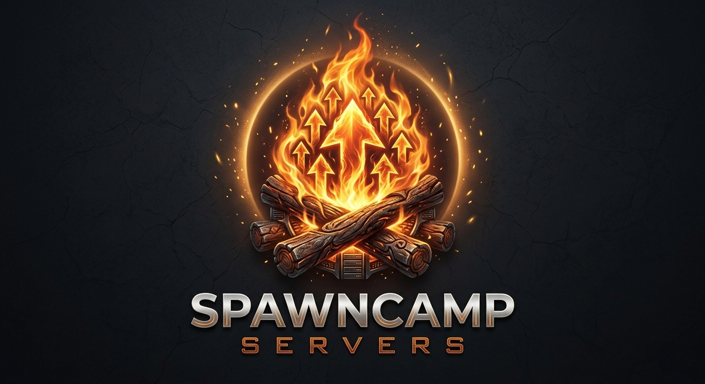

# SpawnCampPZ-Hub



## SpawnCamp Servers — Project Zomboid

A true PvPvE community. Play your way — survivor, trader, medic, hunter, builder, bandit, or faction leader. The choice is yours.

## Welcome Message

> Welcome to **[UK/EU] SpawnCampServers!**
>
> PvE by default — PvP is optional and up to you to toggle on or off.
>
> Read the rules, be respectful, and happy surviving!

## How to Connect

**In-game (Steam):**
```
Server Browser → search "SpawnCampServers" → [UK/EU] SpawnCampServers | PvEvP | QoL | Active Admins.
```

**Direct connect:**
```
Address: spawncampservers.dpdns.org
Port: 16261
```

> DNS for this domain is managed through Cloudflare. Your home IP can still change over time — if the server ever seems unreachable, check Discord for an updated address, or ask the admin to refresh the DNS record.

No whitelist or password required — just join and create your character.

## Join the Community

💬 Discord: [SpawnCampServers Discord](https://discord.gg/XNbx4CkQMw)
☕ Support us: [Ko-fi](https://ko-fi.com/spawncampservers)

## Server Info

| Setting | Value |
|---|---|
| Map | Muldraugh, KY |
| Max Players | 32 |
| Mods | https://steamcommunity.com/sharedfiles/filedetails/?id=3776781446
| PVP | Optional — toggle safety on/off in-game |
| Safehouses | Player & admin claims allowed — 7 in-game days survived to claim |
| Factions | Allowed — 7 in-game days survived to create |
| Sleep | Allowed, not required |
| Fire | Disabled (except campfires) |
| Loot Respawn | Disabled in claimed safehouses |

## PVP & Safety System

- PVP is **enabled server-wide**, but players choose when they're actually vulnerable using the in-game **Safety** toggle (skull & crossbones icon).
- You can only be hurt by another player if **at least one of you** has safety off.
- Toggling safety on/off takes **60 seconds**, with a **60 second cooldown** before you can toggle again — so think ahead, don't expect to flip it mid-fight.

## Community Rules

By joining our Discord or playing on any of our servers, you agree to the following:

- **Respect Everyone** — Treat all members, players, and staff with respect. Harassment, discrimination, hate speech, or real-life threats will not be tolerated and may result in a permanent ban.
- **Keep Discussions Organised** — Use the appropriate Discord channels for chat, bug reports, suggestions, media, and support.
- **No Advertising** — Don't advertise other Discord communities, game servers, products, or services without prior staff approval.
- **NSFW Content** — Only permitted in designated age-restricted channels.

## Gameplay Rules

**Play Your Way** — SpawnCampServers is a true PvPvE community. There are no restrictions on whether you choose PvP or PvE. Trade, build, raid, fight, roleplay, help others, form factions, or survive alone. If it's possible through normal gameplay and isn't listed below, it's allowed.

**Prohibited Behaviour** — the following are strictly forbidden:
- Cheating or using third-party software
- Item duplication
- Exploiting bugs, glitches, or unintended game mechanics
- Using map exploits or terrain glitches to gain an unfair advantage
- Intentionally causing server instability, excessive lag, or attempting to crash the server
- Ban evasion

Any player found breaking these rules may receive a **permanent ban** and have their progression wiped.

## Reports & Support

- **Need help, have a question, or want to report a player?** Head to `#pz-help` in Discord.
- **Video evidence required** — reports involving cheating, exploiting, or other serious rule violations must include clear video evidence. Screenshots and written descriptions alone are not sufficient for staff to investigate.

**PZ Discord channels:**
- `#pz-general` — general chat
- `#pz-announcements` — server updates, restarts, patch notes
- `#pz-events` — community events
- `#pz-trading` — buy/sell/trade between players
- `#pz-looking-for-group` — find people to team up with
- `#pz-help` — questions, support, and player reports
- `#pz-mod-list` — full list of mods (if any are added)
- `#pz-screenshots` — share your survival moments
- `#pz-suggestions` — suggest changes or features

## Live Map

*(Coming soon)* — will be linked here once set up.

---

*Powered by AMP · Hosted by SpawnCampServers*
